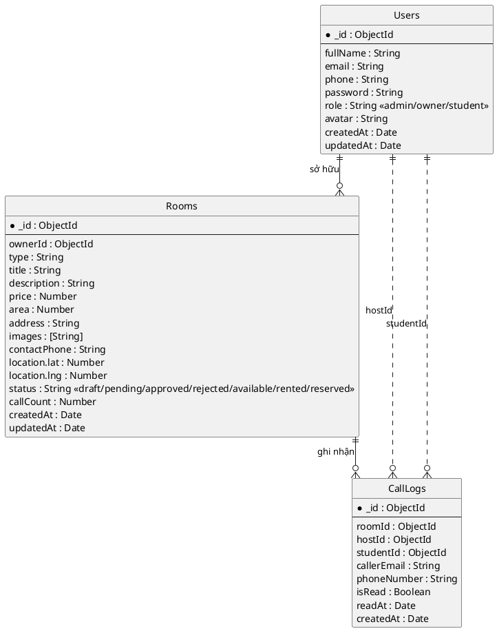

# Mô hình dữ liệu (12/2025)

- `Users` hiện sử dụng trường `fullName` cùng enum vai trò `admin/owner/student`; trường `name` chỉ còn là virtual để tương thích. Script `backend/scripts/migrations/20251210_remove_host_role.js` dùng để chuyển toàn bộ user `host` cũ sang `owner` trước khi deploy.
- `Rooms` lưu `ownerId`, `type`, `contactPhone`, `callCount` và enum trạng thái mở rộng `draft|pending|approved|rejected|available|rented|reserved`. Mỗi tin bắt buộc tối thiểu 3 ảnh trước khi gửi duyệt.
- `CallLogs` theo dõi cả `hostId` (người nhận) lẫn `studentId` (người gọi), email người gọi và các cờ đọc (`isRead`, `readAt`).
- Các collection `ViewLogs`, `Favorites`, `Reports` chưa có model trong codebase nên không nằm trong sơ đồ này.

> Khi các collection `ViewLogs`, `Favorites`, `Reports` được triển khai trong `models/`, hãy bổ sung thêm entity tương ứng cùng quan hệ vào sơ đồ.

## Luồng đăng tin 3 bước (API)

1. **Bước 1 – Thông tin cơ bản**  
    `POST /api/rooms` tạo tin ở trạng thái `draft`. Payload bắt buộc: `type`, `title`, `description`, `price`, `area`, `address`, `contactPhone`.  
    Người dùng chỉnh sửa lại bằng `PUT /api/rooms/:id` để cập nhật text trước khi chuyển bước tiếp theo.

2. **Bước 2 – Hình ảnh**  
    `POST /api/rooms/:id/images` (multipart, field `images`) nhận tối đa 10 ảnh/đợt và lưu vật lý tại `/uploads/rooms`. Tham số phụ `replace=true|false` cho phép thay thế hoàn toàn bộ ảnh hiện có. Backend chỉ cho phép gửi duyệt khi tổng số ảnh trên server ≥ 3.

3. **Bước 3 – Định vị & gửi duyệt**  
    `PUT /api/rooms/:id/location` lưu toạ độ `location.lat/lng` (sử dụng toạ độ OpenStreetMap).  
    Sau khi có ảnh + toạ độ hợp lệ, chủ trọ bấm `POST /api/rooms/:id/submit` để chuyển tin sang `pending`.

> Mobile RN tái cấu trúc thành ba màn hình: BasicInfo, Media, Location. Context `CreatePostContext` giữ `roomId`, danh sách ảnh và toạ độ xuyên suốt, đảm bảo trải nghiệm tuyến tính và không cần AsyncStorage nháp.
